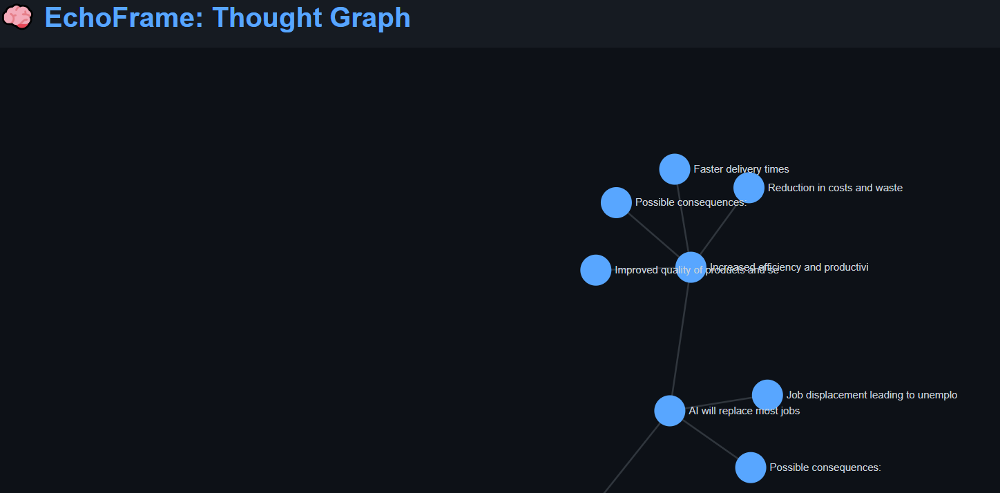

# 🧠 EchoFrame — AI-Powered Recursive Thought Graph (OpenRouter Version)

EchoFrame is a full-stack project that visualizes how ideas evolve. Starting from a single thought, it recursively expands possible consequences, counterpoints, and questions — using a free AI API and a dynamic graph UI.



---

## 🚀 Features

- 💡 Recursive AI-driven thought expansion
- 🌐 No install required — uses OpenRouter API (free-tier GPT access)
- 🧠 Graph structure with click-to-expand idea nodes
- ⚡ FastAPI backend + D3.js frontend
- 🎯 Ideal for thought maps, debate tools, strategy modeling, and creativity

---

## 🧱 Project Structure

```bash
echoframe/ 
├── server/ 
│ ├── app.py # FastAPI app (API + frontend hosting) 
│ ├── generator.py # AI-powered thought expansion (OpenRouter)
│ └── graph.py # Graph logic (nodes + branches)
├── frontend/
│ └── index.html # Interactive D3.js graph UI
```
---

## 🔧 Requirements

### 🐍 Backend
```bash
pip install fastapi uvicorn python-dotenv requests
```
## 🌐 Frontend
No build tools needed — index.html runs in any browser.

## 🛡️ Free API Setup (OpenRouter)
- Go to https://openrouter.ai/keys

 - Sign in and copy your free API key

## ▶️ Running the App
Start the backend:

```bash
uvicorn app:app --reload
```
Open your browser:
```bash
http://localhost:8000
```
Click on nodes to expand new ideas!

## 🧪 Example Thought Map
“AI will replace most jobs”

- Universal Basic Income may become necessary
- Ethical concerns over replacing human labor
- AI may enhance job creativity, not replace it
- Regulation will lag behind adoption

## 💡 Future Ideas
- Add personas (Philosopher, Optimist, Critic)
- Export thought graphs to .json or .graphml
- Add GPT-4, Claude, or Llama2 model switching
- Publish a public version with authentication
